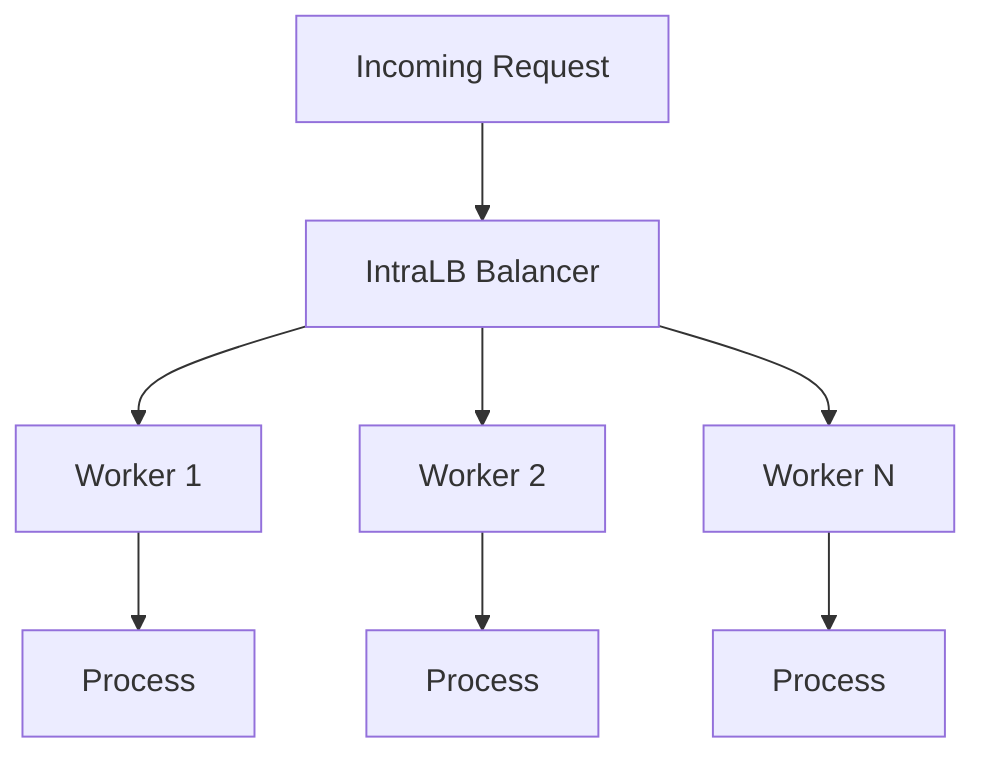

# 🚦 IntraLB - Intelligent Load Balancer for Go HTTP Services

> **IntraLB** is a lightweight, intra-process load balancer built for Go HTTP servers. It offers intelligent request routing, worker-based concurrency, graceful shutdowns, and database safety with a developer-friendly interface.

---

## 📦 Installation

Install with:

```bash
go get github.com/mmycin/intralb
```

---

## ⚡ Quick Start

```go
package main

import (
    "net/http"
    "github.com/go-chi/chi/v5"
    "github.com/mmycin/intralb/config"
    "github.com/mmycin/intralb/balancer"
)

func main() {
    router := chi.NewRouter()
    router.Get("/", func(w http.ResponseWriter, r *http.Request) {
        w.Write([]byte("Hello World"))
    })

    cfg := &config.Options{
        MaxConcurrentPerRouter: 100,
        QueueSize:              100,
        EnableLogging:          true,
        GracefulTimeoutSeconds: 5,
    }

    lb := balancer.New(router, cfg)
    http.ListenAndServe(":8080", lb.BalanceLoad())
}
```

---

## ⚙️ Configuration Options

```go
type Options struct {
    MaxConcurrentPerRouter int                 // Max concurrent requests per router (default: 100)
    QueueSize              int                 // Buffer size per worker queue (default: 100)
    EnableLogging          bool                // Enable verbose logging (default: false)
    GracefulTimeoutSeconds int                 // Graceful shutdown timeout in seconds (default: 5)
    DBInitFunc             func(id string) any // Optional DB session initializer for each worker group
}
```

---

## 💡 Features

- **🧵 Worker Pool Architecture**: Concurrent request handling using Go routines with load tracking
    
- **📈 Auto Scaling**: Dynamically adjusts workers based on demand
    
- **🛑 Graceful Shutdown**: Ensures in-flight requests complete before shutdown
    
- **⏱️ Request Timeout Handling**: Configurable grace period per request
    
- **🗄️ DB Session Management**: Per-worker DB connection safety
    
- **🔀 Load-Aware Routing**: Routes to least-busy worker using atomic counters
    

---

## 🧠 Architecture Overview

### 🛠 Worker Pool Model

1. **Flow**:
    
    ```
    Client → IntraLB → Queue → Worker → Handler
    ```
    
2. **Scaling**:
    
    - Workers spawn dynamically on load
        
    - Capped concurrency avoids memory overuse
        
3. **Load Balancing**:
    
    - Atomic counters track real-time worker load
        
    - Requests go to least busy available worker
        

### 🕸 Concurrency Model



---

## 🧪 Advanced Usage

### 🧩 Per-Worker DB Sessions

```go
cfg := &config.Options{
    DBInitFunc: func(workerID string) any {
        return initWorkerDB(workerID) // Return db instance (e.g., *sql.DB, *mongo.Client, etc.)
    },
}
```

### 🧱 Custom Middleware Support

```go
func loggingMiddleware(next http.Handler) http.Handler {
    return http.HandlerFunc(func(w http.ResponseWriter, r *http.Request) {
        log.Println("Incoming request")
        next.ServeHTTP(w, r)
        log.Println("Completed")
    })
}

router := chi.NewRouter()
router.Use(loggingMiddleware)
```

Apply your middleware before passing the router to the balancer.

### 🧼 Graceful Shutdown

```go
server := &http.Server{
    Addr:    ":8080",
    Handler: lb.BalanceLoad(),
}

go func() {
    if err := server.ListenAndServe(); err != nil && err != http.ErrServerClosed {
        log.Fatalf("ListenAndServe: %v", err)
    }
}()

balancer.GracefulShutdown(server, 10*time.Second)
```

---

## 📏 Performance Considerations

|Workers|Requests/sec|Latency (p95)|
|---|---|---|
|10|8,500|12ms|
|50|32,000|8ms|
|100|58,000|6ms|
|200|72,000|9ms|

Performance varies by CPU, memory, and handler complexity.

---

## 🧰 Best Practices

- ✅ Apply critical middleware (like auth, rate limiting) **before** the balancer
    
- ✅ Keep `DBInitFunc` lightweight; use pooling/connection reuse
    
- ✅ Gracefully recover panics in handlers
    
- ✅ Use metrics to monitor worker starvation or queue overflows
    

---

## 🛠 Example Implementations

### 🧪 Basic API Server

```go
func main() {
    r := chi.NewRouter()
    r.Get("/api", func(w http.ResponseWriter, r *http.Request) {
        w.Write([]byte("API Response"))
    })

    cfg := &config.Options{
        MaxConcurrentPerRouter: 50,
        GracefulTimeoutSeconds: 10,
    }

    lb := balancer.New(r, cfg)
    http.ListenAndServe(":8080", lb.BalanceLoad())
}
```

### 🏗 Microservice Gateway

```go
func main() {
    r := chi.NewRouter()
    r.Mount("/users", userRouter())
    r.Mount("/products", productRouter())

    cfg := &config.Options{
        MaxConcurrentPerRouter: 200,
        QueueSize:              500,
        DBInitFunc: func(id string) any {
            return createDBClient(id)
        },
    }

    lb := balancer.New(r, cfg)

    server := &http.Server{
        Addr:    ":8080",
        Handler: lb.BalanceLoad(),
    }

    balancer.GracefulShutdown(server, 15*time.Second)
    server.ListenAndServe()
}
```

---

## 🧹 Troubleshooting

|Problem|Solution|
|---|---|
|Request Timeout|Increase `GracefulTimeoutSeconds`; avoid blocking handlers|
|High Memory Usage|Reduce `QueueSize` or lower `MaxConcurrentPerRouter`|
|Worker Starvation|Tune worker count; review handler logic and DB latency|
|Middleware Not Working|Ensure it's registered _before_ the balancer|

---

## 🤝 Contributing

We welcome contributions!

1. Fork the repo
    
2. Create a new feature branch
    
3. Submit a Pull Request with clear descriptions and test coverage
    

Please ensure you follow Go idioms and update documentation/tests accordingly.

---

## 📄 License

**MIT License**

See the [LICENSE](https://chatgpt.com/c/LICENSE) file for full details.

---

## 🌐 Project Links

- GitHub: [github.com/mmycin/intralb](https://github.com/mmycin/intralb)
    
- GoDoc: Coming soon
    
- Issues: [Report or view](https://github.com/mmycin/intralb/issues)
    
